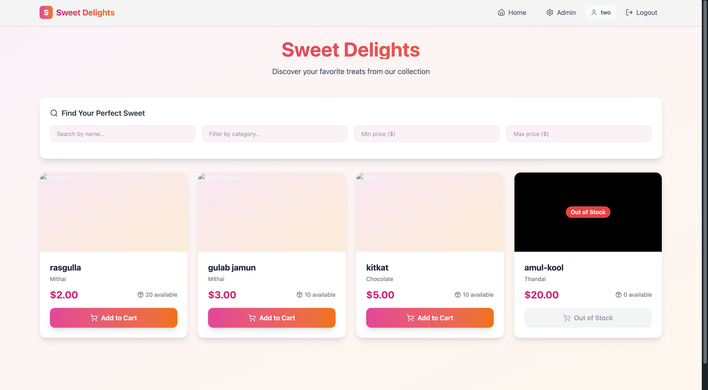
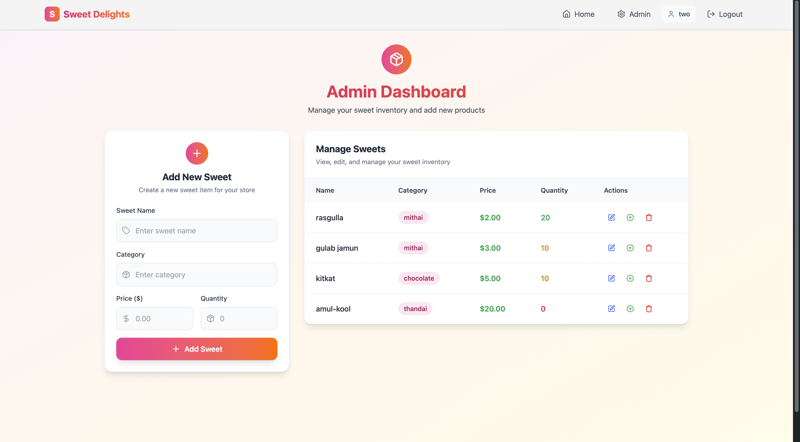
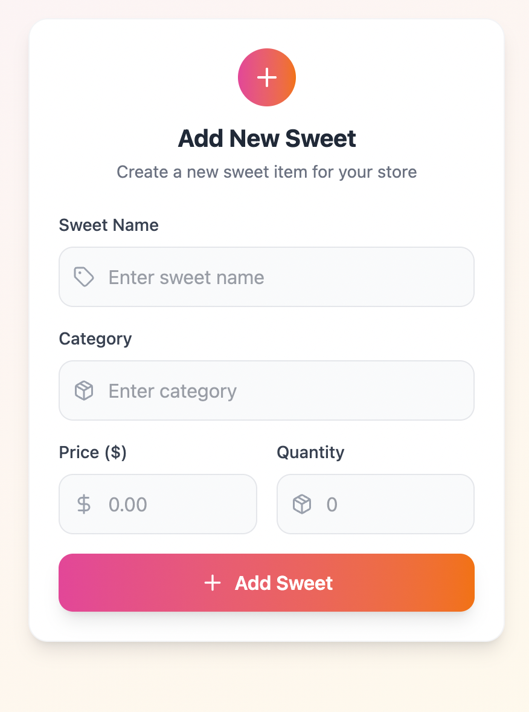

# 🍬 Sweet Management System

A full-stack MERN application for managing a sweet shop inventory with user authentication, admin controls, and comprehensive testing.


## 📖 Project Overview

The Sweet Management System is a modern web application designed for sweet shop owners to manage their inventory efficiently. The system provides different functionalities for regular users and administrators, ensuring proper access control and seamless user experience.

### 🌟 Key Features

**For All Users:**
- 🔐 **User Authentication**: Secure registration and login system
- 🍭 **Browse Sweets**: View available sweets with details (name, category, price, quantity)
- 🔍 **Search & Filter**: Advanced search functionality to find specific sweets
- 🛒 **Purchase System**: Buy sweets with automatic inventory updates
- 📱 **Responsive Design**: Works seamlessly on desktop and mobile devices

**For Administrators:**
- ⚙️ **Admin Dashboard**: Comprehensive management interface
- ➕ **Add Sweets**: Create new sweet entries with validation
- ✏️ **Update Inventory**: Modify existing sweet details and pricing
- 🗑️ **Delete Items**: Remove discontinued sweets from inventory
- 📦 **Restock System**: Easily update quantities for existing items
- 👥 **User Management**: View and manage system users

### 🏗️ Architecture

**Frontend:**
- ⚛️ **React 19** with modern hooks and functional components
- 🎨 **TailwindCSS + DaisyUI** for beautiful, responsive styling
- 🗄️ **Zustand** for lightweight state management
- 🚦 **React Router** for client-side navigation
- 📡 **Axios** for HTTP requests
- 🎯 **React Hot Toast** for user notifications

**Backend:**
- 🚀 **Node.js + Express** for robust server architecture
- 🍃 **MongoDB + Mongoose** for flexible data modeling
- 🔐 **JWT Authentication** with bcrypt password hashing
- 🛡️ **CORS** enabled for cross-origin requests
- 📝 **Express Async Handler** for clean error handling

**Testing:**
- 🧪 **Jest + Supertest** for comprehensive backend testing
- 🎭 **React Testing Library** for frontend component testing
- 📊 **82 Tests** with **100% Pass Rate**
- 🎯 **Complete API Coverage** including authentication and CRUD operations

## 🚀 Getting Started

### 📋 Prerequisites

Before running this project, make sure you have the following installed:

- **Node.js** (v18.0.0 or higher)
- **MongoDB** (v6.0 or higher)
- **npm** or **yarn** package manager
- **Git** for version control

### 💾 Installation

1. **Clone the repository**
   ```bash
   git clone https://github.com/raheelhparekh/sweet-management-system.git
   cd sweet-management-system
   ```

2. **Backend Setup**
   ```bash
   cd backend
   npm install
   ```

3. **Frontend Setup**
   ```bash
   cd ../frontend
   npm install
   ```

### ⚙️ Configuration

1. **Backend Environment Variables**
   
   Create a `.env` file in the `backend` directory:
   ```env
   MONGO_URI=mongodb://127.0.0.1:27017/sweet_shop
   JWT_SECRET=your_super_secret_jwt_key_here
   PORT=8000
   NODE_ENV=development
   FRONTEND_URL=http://localhost:5173
   ```

2. **Frontend Environment Variables**
   
   Create a `.env` file in the `frontend` directory:
   ```env
   VITE_BACKEND_URL=http://localhost:8000
   ```

3. **Database Setup**
   
   Make sure MongoDB is running on your system:
   ```bash
   # On macOS with Homebrew
   brew services start mongodb-community
   
   # On Ubuntu
   sudo systemctl start mongod
   
   # On Windows
   net start MongoDB
   ```

### 🏃‍♂️ Running the Application

1. **Start the Backend Server**
   ```bash
   cd backend
   npm run dev
   ```
   The backend will start on `http://localhost:8000`

2. **Start the Frontend Development Server**
   ```bash
   cd frontend
   npm run dev
   ```
   The frontend will start on `http://localhost:5173`

3. **Access the Application**
   - Open your browser and navigate to `http://localhost:5173`
   - Register a new account or use existing credentials
   - Explore the sweet management features!

### 🧪 Running Tests

**Backend Tests:**
```bash
cd backend
npm test                    # Run all tests
npm run test:watch         # Run tests in watch mode
npm run test:coverage      # Run tests with coverage report
```

**Frontend Tests:**
```bash
cd frontend
npm test                    # Run all tests
npm run test:watch         # Run tests in watch mode
npm run test:coverage      # Run tests with coverage report
```

**Complete Test Suite:**
- **Backend**: 56 tests covering API endpoints, models, middleware, and authentication
- **Frontend**: 26 tests covering components, stores, and user interactions
- **Total**: 82 tests with 100% pass rate

## 📱 Application Screenshots

### 🏠 Home Page

*Browse available sweets with search and filter capabilities*

### 🔐 Authentication

*Secure user authentication with form validation*

### 👨‍💼 Admin Dashboard

*Comprehensive admin interface for inventory management*

### ➕ Add New Sweet

*Form validation and real-time feedback for adding new items*

### 📊 Inventory Management

*Complete inventory overview with action buttons*

## 🎯 API Endpoints

### Authentication Routes
```
POST /api/auth/register    # User registration
POST /api/auth/login       # User login
POST /api/auth/logout      # User logout
GET  /api/auth/me          # Get current user profile
```

### Sweet Management Routes
```
GET    /api/sweets           # Get all sweets
GET    /api/sweets/search    # Search sweets with filters
GET    /api/sweets/:id       # Get sweet by ID
POST   /api/sweets           # Create new sweet (Admin only)
PUT    /api/sweets/:id       # Update sweet (Admin only)
DELETE /api/sweets/:id       # Delete sweet (Admin only)
POST   /api/sweets/:id/purchase   # Purchase sweet
POST   /api/sweets/:id/restock    # Restock sweet (Admin only)
```

## 🛠️ Technology Stack

| Category | Technologies |
|----------|-------------|
| **Frontend** | React 19, TailwindCSS, DaisyUI, Zustand, React Router, Axios |
| **Backend** | Node.js, Express.js, MongoDB, Mongoose, JWT, bcrypt |
| **Testing** | Jest, Supertest, React Testing Library, @testing-library/jest-dom |
| **Development** | Vite, ESLint, Nodemon, Babel, JSDOM |
| **DevOps** | Git, npm, Environment Variables |

## 📂 Project Structure

```
sweet-management-system/
├── backend/
│   ├── src/
│   │   ├── controllers/     # Route handlers
│   │   ├── middleware/      # Authentication & error handling
│   │   ├── models/          # Database schemas
│   │   ├── routes/          # API route definitions
│   │   ├── utils/           # Utility functions
│   │   ├── config/          # Database configuration
│   │   └── __tests__/       # Backend test suites
│   ├── package.json
│   └── jest.config.js
├── frontend/
│   ├── src/
│   │   ├── components/      # Reusable React components
│   │   ├── pages/           # Page components
│   │   ├── store/           # Zustand state stores
│   │   ├── lib/             # Utility libraries
│   │   └── __tests__/       # Frontend test suites
│   ├── package.json
│   ├── vite.config.js
│   └── tailwind.config.js
└── README.md
```

## 🤖 My AI Usage

### AI Tools Used

I extensively utilized **GitHub Copilot** as my primary AI coding assistant

### How I Used AI

**1. Initial Project Architecture & Planning**
- Generated initial boilerplate code for both backend and frontend setups

**2. Frontend Development**
- **Styling**: Copilot helped create TailwindCSS classes and DaisyUI component implementations

**3. Testing Implementation**
- **Backend Tests**: Used Copilot to generate comprehensive Jest + Supertest test suites
  - Generated 56 backend tests covering authentication, CRUD operations, and middleware
  - Created MongoDB Memory Server setup for isolated testing
  - Implemented test helpers and mock data generators
- **Frontend Tests**: Copilot assisted in creating React Testing Library tests
  - Generated 26 frontend tests for components and user interactions
  - Created mock implementations for Zustand stores and API calls
  - Fixed complex async testing scenarios and state management tests

**4. Documentation & Code Quality**
- Generated comprehensive inline code comments and JSDoc documentation
- Used AI to create consistent naming conventions across the codebase
- Implemented proper error messages and user feedback systems

### Reflection on AI Impact

**Positive Impacts:**
- **Accelerated Development**: AI significantly reduced development time, especially for repetitive tasks like CRUD operations and test case generation
- **Testing Excellence**: AI was particularly valuable in generating comprehensive test suites, helping achieve 100% test pass rates
- **Consistency**: AI helped maintain consistent code style and patterns across both frontend and backend

**Challenges & Considerations:**
- **Context Understanding**: Sometimes Copilot generated code that needed adjustment to fit the specific project context
- **Over-reliance Risk**: Had to be careful not to blindly accept AI suggestions without understanding the underlying logic
- **Testing Complexity**: AI-generated tests sometimes needed refinement for proper async handling and state management
- **Configuration Issues**: AI suggestions for configuration files occasionally needed manual tweaking

**Workflow Transformation:**
- **Reduced Boilerplate**: Significantly less time spent on repetitive code patterns
- **Better Documentation**: AI helped maintain comprehensive documentation throughout development

**Key Learnings:**
- AI is most effective when used as a collaborative tool rather than a replacement for understanding
- Manual review and testing of AI-generated code is essential
- AI excels at pattern recognition and generating consistent code structures
- Human oversight remains crucial for architectural decisions and business logic

## 📊 Testing Coverage

The application maintains high-quality standards with comprehensive testing:

- **Backend Tests**: 56 tests (100% passing)
  - Authentication endpoints and JWT handling
  - CRUD operations for sweet management
  - Database model validation
  - Middleware functionality
  - Error handling and edge cases

- **Frontend Tests**: 26 tests (100% passing)
  - Component rendering and user interactions
  - Form validation and submission
  - State management with Zustand stores
  - API integration and error handling
  - Navigation and routing

## 🤝 Contributing

1. Fork the repository
2. Create your feature branch (`git checkout -b feature/amazing-feature`)
3. Commit your changes (`git commit -m 'Add some amazing feature'`)
4. Push to the branch (`git push origin feature/amazing-feature`)
5. Open a Pull Request

## 👨‍💻 Author

**Raheel Parekh**
- GitHub: [@raheelhparekh](https://github.com/raheelhparekh)
- Project: [sweet-management-system](https://github.com/raheelhparekh/sweet-management-system)


*Built with ❤️ using the MERN stack and modern development practices*